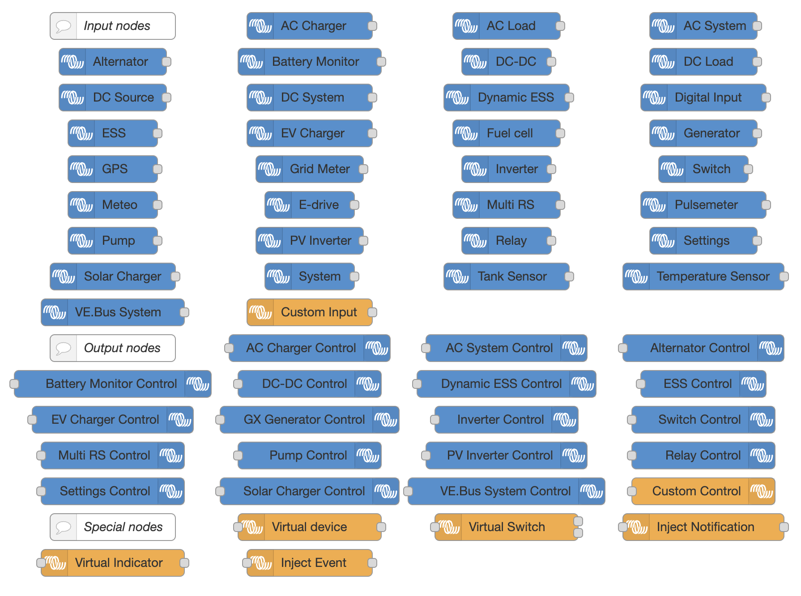

# Victron Energy Nodes for Node-RED



Custom Node-RED nodes for Victron Energy products. Makes it easy to create automations for Victron systems.

[](https://badge.fury.io/js/%40victronenergy%2Fnode-red-contrib-victron)

## Quick Start

The recommended way to use these nodes is through [Venus OS Large](https://www.victronenergy.com/live/venus-os:large), where they come pre-installed with Node-RED.

For manual installation and advanced setup, see our [Installation Guide](https://github.com/victronenergy/node-red-contrib-victron/blob/master/docs/INSTALL.md).

## Documentation

- [User Guide](https://github.com/victronenergy/node-red-contrib-victron/blob/master/docs/USER_GUIDE.md) - How to use the nodes
- [Example Flows](https://github.com/victronenergy/node-red-contrib-victron/wiki/Example-Flows)
- [Developer Guide](https://github.com/victronenergy/node-red-contrib-victron/blob/master/docs/DEVELOPMENT.md) - Contributing and development setup

## Available Nodes

### Input Nodes
Input nodes allow you to read data from your Victron devices:
- Device selector with available Victron equipment
- Measurement selector showing available data points
- Custom labeling options

### Output Nodes
Output nodes let you control Victron devices:
- Device selector
- Measurement selector (showing writable services)
- Initial value settings
- Custom labeling options

### Virtual Devices
Create simulated Victron devices on the dbus:
- Battery
- Generator
- GPS
- Grid meter
- Indicator
- Meteo
- Motor drive
- PV inverter
- Switch
- Tank sensor
- Temperature sensor

### Utility Nodes
- **Inject Notification** - Send a pop-up notification to the Venus OS GUI
- **Inject Event** - Send an event to the VRM portal Event logs tab (Warning, Critical, Info)

For detailed examples, visit our [Example Flows](https://github.com/victronenergy/node-red-contrib-victron/wiki/Example-Flows).

## Support

This library is community-supported. For help:
- Visit [Victron Community](https://community.victronenergy.com/c/node-red/28)
- Check our [Wiki](https://github.com/victronenergy/node-red-contrib-victron/wiki)
- File issues on [GitHub](https://github.com/victronenergy/node-red-contrib-victron/issues)

## Contributing

Contributions are welcome! See our [Contributing Guide](https://github.com/victronenergy/node-red-contrib-victron/blob/master/CONTRIBUTING.md) for details.

## Development

### Setup

TBD

### Testing

Unit tests can be run with `npm test`, see ./package.json for details.

Black box testing, currently experimental, can be run with `npm run test:e2e`. To run it with live-reload, use `npm run test:e2e -- --live`.

To run an individual e2e / black box test, against Chrome, with live-reload:

```bash
npx testcafe chrome testcafe/switches-config-test.js --live
```

To run e2e tests against a local installation (without running via VRM), define `NODE_RED_ENDPOINT`:

```bash
VRM_PORTAL_ID=my-portal-id LOCAL_MQTT_ENDPOINT=mqtt://localhost:1883 NODE_RED_ENDPOINT=http://localhost:1880 npm run test:e2e
```

## License

[MIT](https://github.com/victronenergy/node-red-contrib-victron/blob/master/LICENSE)
