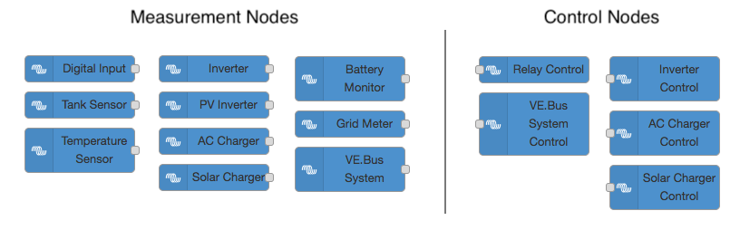
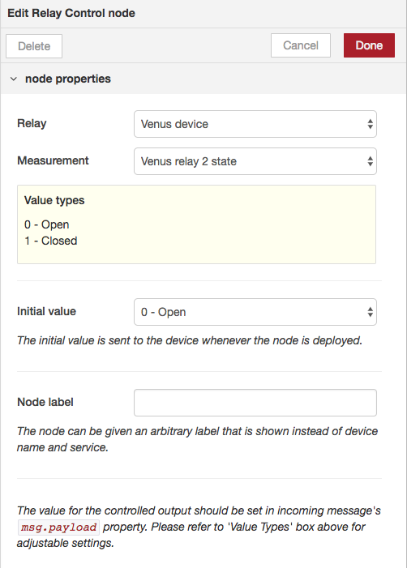

# Custom Victron Energy nodes for Node-RED

This library provides custom Node-RED nodes for some of the most commonly used Victron Energy products. The aim is to make it easier and faster for users to create automations without actually having to touch any of the devices' internals.

This library is made as part of the "Add Node-RED to Venus OS"-project: which is about adding Nodejs, npm, node-red and more all into the Venus OS images. Draft manual [here](https://www.victronenergy.com/live/venus-os:large-image) and issue [here](https://github.com/victronenergy/venus/issues/378).

This library is not officially supported by Victron Energy: don't call our dealers or other support channels for help.

For any questions or help, please turn to [community.victronenergy.com](https://community.victronenergy.com). Pull-requests are willingly encouraged!

## Requirements when self-installing this node palette
- A Victron system that includes a GX device (note that for trial & development you could use the demo mode in Venus OS, Settings -> General)
- D-Bus configuration on Venus OS to be modified to bind to TCP

More details in the [instructions](#Installation-and-Usage).

## Usage and examples

When the Node-RED is started, a Victron Energy configuration node is automatically created, connecting to the dbus in the Venus device. All the node services and measurements can be found on [services.json](/src/services/services.json) -- however only those services and measurements that are available in the system are shown in the node edit panel.



*Node-palette - Input nodes on the left, output nodes on the right*

Here's an example on a functional flow with the Victron Nodes. More in-depth examples and use cases can be found in [wiki/Example-Flows](https://github.com/victronenergy/node-red-contrib-victron/wiki/Example-Flows).


### Input Nodes

The input nodes have two selectable inputs: the devices select and measurement select. The available options are dynamically updated based on what sort data is actually available on the Venus device dbus.

```
Device Select       - lists all available devices
Measurement Select  - lists all available device-specific measurements
Node label Input    - sets a custom label for the node
```

The measurement unit type is shown in the measurement label in brackets, e.g. Battery voltage (V).
In case the data type is enumerated, an approppriate enum legend is shown below the selected option.


### Output Nodes

Input Nodes have the same options available, but the selectable 'measurement' only lists writable services. Additionally, the user can set an initial value to the service, which is sent whenever the flow is deployed.


All output nodes should have the control value set in its incoming message's `msg.payload` property.

```
Device Select       - lists all available devices
Measurement Select  - lists all available device-specific measurements
Initial value Input - initializes the device when the flow is deployed
Node label Input    - sets a custom label for the node
```



### Example Flows

Please head to [wiki/Example-Flows](https://github.com/victronenergy/node-red-contrib-victron/wiki/Example-Flows) for example flows implemented with the Victron Energy nodes.

## Architecture

### Plugin Behavior

All the individual nodes (inputs / outputs) will use a singleton instance of a Victron Config Node to access the system dbus in a Venus device. The nodes will provide an easy-to-use interface for accessing various measurements and writing data to the system.

The following graph demonstrates the architecture of this plugin.

1. Upon initialization, the Victron Config Node initializes a VictronClient and SystemConfiguration instances. VictronClient connects to the Venus D-Bus and starts maintaining a cache of available services.

2. When a user modifies a node (e.g. battery node), the node fetches the available dbus services from the local SystemConfiguration cache and renders relevant inputs to the edit view.

3. When a node is deployed, they either subscribe a message handler to the VictronClient or start publishing data to a desired D-Bus path.


### Directory Structure
```
.
├── documentation
├── scripts
│   ├── csv                         | input CSV files for the parser script
│   ├── parse-services.js           | parses the services.json used by nodes
│   └── service-whitelist.js        | dbus service/path whitelist for the parser
└── src
    ├── nodes
    │   ├── icons
    │   │   └── victronenergy.svg
    │   ├── config-client.html
    │   ├── config-client.js
    │   ├── victron-nodes.html
    │   └── victron-nodes.js
    └── services
        ├── services.json           | used for node config generation
        ├── utils.js
        ├── dbus-listener.js
        ├── victron-client.js       | Victron Energy dbus-client
        └── victron-system.js       | DBus service cache
```

## Installation and Usage

NOTE: these instructions are about how to install and make this node pallette working on your own Node-RED installation. Make sure that is what you want and need. The more common solution is to [use Node-RED already pre-installed inside Venus OS](https://www.victronenergy.com/live/venus-os:large-image).

WARNINGS: (A) Only do this on a trusted network. Exposing D-Bus to TCP is not secured - anyone on the same network can do
anything he/she wants after enabling this setting. (B) If you do below change incorrectly, the GX Device will no longer
boot correctly and will also not enable SSH nor Remote Console anymore. Also the GUI won't work; nor will anything else.
Basically its rendered unusable, until either debugged via the serial console using a
[serial console cable](https://www.adafruit.com/product/954); or reinstalled using an factory installation image on an
sdcard. Note that after factory installation, certain files must be put back in order for, for example, the wifi to
work again. There is no complete documentation about how to restore those, but the information here will at least help:
[Venus OS Extended manual - Repart. appendix](https://www.victronenergy.com/live/venus-os:extended#appendix_a_-_repartitioning_venus_gx_flash_memory).
(C) below modifications are on ones own risk. We'll help where possible; but there are only a few
people available within Victron that can help; and they won't be standby all the time to help with issues like this:
only do this when you (I) are not in a rush when it goes wrong and (II) are technical and know what you are doing. To
get help, you could try the issues, as well as the
[Modifications section on Community](https://community.victronenergy.com/spaces/31/index.html). (D) Remember that a 
firmware update of the GX device will override below advised (and any other) changes to the rootfs.

To make above this change, you'll need [root access to the GX device](https://www.victronenergy.com/live/ccgx:root_access).

With all those (important!) warnings out of the way, here are the steps to locally install Node-REDand this
plug-in. As well as the step to Open up the GX device, so that it can be communicated with remotely by this
node-red plugin:

1. install node-red on your system
2. cd to the node-red user directory, typically `~/.node-red`
3. install node-red-contrib-victron locally, `npm install @victronenergy/node-red-contrib-victron`
4. enable d-bus over tcp in your Venus device **if you want to use dbus over TCP**, otherwise skip this step. Edit `/etc/dbus-1/system.conf` and add the following directly above `<policy context="default">`:

```
  <listen>tcp:host=0.0.0.0,port=78</listen>
  <auth>ANONYMOUS</auth>
  <allow_anonymous/>
```

5. the client can connect to dbus either using tcp or directly via system socket.
  - the client defaults to a socket connection systembus, with a socket 'unix:path=/var/run/dbus/system_bus_socket'. This should directly work with a Venus device.
  - (You can  `DBUS_SYSTEM_BUS_ADDRESS` to change the systembus socket path or alternatively set `DBUS_SESSION_BUS_ADDRESS` to use sessionbus via socket)
  - set the environment variable `NODE_RED_DBUS_ADDRESS` to connect via TCP. The variable should be a string with an ip and port separated by a colon, e.g. `export NODE_RED_DBUS_ADDRESS=192.168.1.1:78`

6. you can optionally run the plugin with a DEBUG=* environment variable set, to see additional debug information printed on the shell. E.g. `export DEBUG=node-red-contrib-victron*`

Further information on [nodered.org](https://nodered.org/docs/creating-nodes/first-node) and
[this other project that requires the same mod](https://github.com/sbender9/signalk-venus-plugin#plugin-installation--configuration).


## Generating the node specification file (developers)

All the nodes use a manually generated [services.json](/src/services/services.json) file to figure out what dbus services and paths to expose to the end-user. This file is used to e.g. render the labels to the 'Select measurement' dropdowns in node-RED's edit view. Please note, that this file is not a full representation of all available dbus paths -- rather, a subset of services and paths that the node-red nodes actually use.

This `services.json` file is generated using the `parse-services.js` script in `./scripts` directory. The script uses two CSV files, `dataAttributes.csv` and `dataAttributeEnums.csv`, as its primary source to generate an up-to-date listing of available dbus services and dbus paths for Victron Energy's devices.

(Unfortunately, the CSV files are not committed to the repo for now -- if you need to update the services.json, please ask for the CSVs from Victron Staff or run the parse-services script with the `--append` switch).

The parsed services and paths are filtered against a whitelist (`service-whitelist.js`) before saving the file in order to get rid of undesired or deprecated dbus paths and only reveal the paths actually relevant to the VE nodes.


1. Before running the script, please ensure that you have valid data csv's (`dataAttributes.csv`, `dataAttributeEnums.csv`) in the `./scrip/csv` directory. Edit the `service-whitelist.js` to control all the available fields to the nodes. (Alternatively use `--append`, see below)
2. Run the script `node run parse-services.js`
3. If some of the whitelisted services or paths are not found on the CSV files, the script will print out all the missing dbus paths. The script will also generate a `missingpaths.template.json` file, which can be manually populated and added as an extra input to the script.
4. Copy, rename and populate the `missingpaths.template.json` and run the script again, this time with an extra argument: `node parse-services.js ./missingpaths.json`. This extra input file can also be used to overwrite parsed CSV rows, for example.
5. You are done! The new fields in `services.json` can be verified using a your favorite diff tool (`git diff`, for example).

## Adding new nodes (developers)

A few modifications to the code are needed in order to add new nodes (or new paths to existing ones). Here's an example on how to add a new input node `victron-test`. It uses the dbus service `com.victronenergy.settings` and has one option for a path `/Settings/TestDbusPath`.

1. Add the nodetype to scripts/service-whitelist.js
```
    "input-test": {
        "settings": [
            "/Settings/TestDbusPath",
        ]
    }
```

2. Run `node parse-services.js ./missingpaths.json` to generate a new `services.json`, which is used to render the node options. If some of the whitelisted path definitions are missing from the given input CSV's (or missingpaths.json), a missingpaths.template.json is generated with pre-filled objects for the path definitions. You should fill in the missing data, and copy-paste the new json objects to missingpaths.json file. Run the script again until no more missing paths are printed to the console.

You can use the `--append` switch to completely bypass the whitelist, missingpaths.json and csv parsing. This is useful if you don't have access to the CSV files. This will simply merge the given input json file with the existing services.json: `node parse-services.json ./additionalPaths.json --append`.

3. Add the following rows to given files:
```
// The following function defines what services are showin in
// /victron/services/ API endpoint.
// src/services/victron-system.js - listAvailableServices()
"input-test": this.getNodeServices("input-test"),

// Creates a new node-definition for node-red backend API
// src/nodes/victron-nodes.js
RED.nodes.registerType('victron-input-test', BaseInputNode);

// Creates a new node-definition for node-red frontend API
// src/nodes/victron-nodes.html
registerInputNode('victron-input-test', 'Test', 'input-test');
```

4. Restart Node-RED and test the new node. It should be visible under Victron Energy nodes. If the path `/Settings/TestDbusPath` is present in dbus under `com.victronenergy.settings`, the node will show the path as an option in its edit panel settings (otherwise it will be hidden and you will probably see a disclaimer text on missing services).

## Releasing a new version (developers)

Below procedure makes a new version, and also updates all dependencies as recorded
in package-lock.json. And includes instructions on how to update the corresponding
npm-shrinkwrap.json which is maintained in meta-victronenergy. Doing that is
important: in Venus OS, the dependencies are installed exactly as recorded in the
shrinkwrap file. Which is different from how an npm install normally works. This is
done to have reproducible builds; and makes sense when you think about it.

To only make a new release, without such refresh, the following steps are adviced:

1. Run `npm version [major|minor|patch]`, this will increase the version in both the packa
2. Run `npm run release`
3. Run `npm publish`

Here is the full story including a refresh:

Note that this assumes that you've already made changes to the code, and committed them!
```
# these first two lines can be skipped if working from your dev dir.
git clone git@github.com:victronenergy/node-red-contrib-victron.git
cd node-red-contrib-victron

# npm install will only install the latest safe version of the dependencies if they
# don’t exist in the node_modules folder and, there is no package-lock.json file. 
rm ./package-lock.json && rm -rf ./node-modules

# run the installer.
# --only-prod is necessary to prevent installing devDependencies, since npm will
# do that automatically when its run inside a package directory.
npm install --only=prod

# there will now be a new package-lock.json, to see the difference:
git diff

# commit the new package-lock
git add ./package-lock.json && git commit

# here you want to test before actually making the release(!)
DO YOUR TESTS; MAKE SURE TO DO THEM WITH THE RIGHT DEPENDENCIES

# increase the version (this just ups the version in package.json and package-lock.json as
# well as commits it in git. The patch flag tells it to increase the "patch" version. The
# other two,  major and minor can be increased as well by using those respective keywords.
npm version patch

# get the shrinkwrap
npm shrinkwrap

# and now copy the resulting file into the meta-victronenergy repo.

