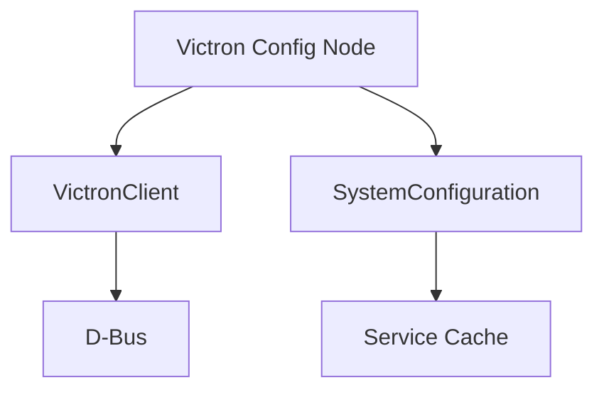

# Development Guide

## Architecture Overview

### Core Components

1. **Victron Config Node**
   - Manages D-Bus connection
   - Initializes core services
   - Maintains system configuration

2. **VictronClient**
   - Handles D-Bus communication
   - Manages message subscriptions
   - Maintains service cache

3. **SystemConfiguration**
   - Tracks available services
   - Provides service metadata
   - Manages device discovery



## Development Environment Setup

### Prerequisites
1. Node.js (LTS version recommended)
2. Access to a GX device or simulator
3. Git
4. Basic understanding of:
   - Node-RED node development
   - D-Bus
   - Victron Energy systems

### Initial Setup

1. **Clone Repository**
   ```bash
   git clone https://github.com/victronenergy/node-red-contrib-victron.git
   cd node-red-contrib-victron
   ```

2. **Install Dependencies**
   ```bash
   npm install
   ```

3. **Link for Development**
   ```bash
   npm link
   cd ~/.node-red
   npm link @victronenergy/node-red-contrib-victron
   ```

## Adding New Nodes

### 1. Define Service Whitelist
```javascript
// scripts/service-whitelist.js
module.exports = {
    "input-new-node": {
        "service_type": [
            "/Path/To/Service",
        ]
    }
}
```

### 2. Generate Service Definitions
```bash
node parse-services.js ./missingpaths.json
```

### 3. Create Node Files
```javascript
// src/nodes/victron-nodes.js
RED.nodes.registerType('victron-input-new-node', BaseInputNode);

// src/nodes/victron-nodes.html
registerInputNode('victron-input-new-node', 'New Node', 'input-new-node');
```

### 4. Update System Configuration
```javascript
// src/services/victron-system.js
listAvailableServices() {
    return {
        "input-new-node": this.getNodeServices("input-new-node"),
        // ...
    }
}
```

## Testing

### Manual Testing
1. Deploy to test environment
2. Verify node behavior
3. Test error conditions
4. Validate documentation

## Release Process

### 1. Update Dependencies
```bash
rm ./package-lock.json ./npm-shrinkwrap.json ./yarn.lock
rm -rf ./node_modules
npm install --omit=dev
```

### 2. Version Bump
```bash
npm version [major|minor|patch]
```

### 3. Build and Test
```bash
npm run build
npm test
```

### 4. Release
```bash
npm run release
npm publish
```

## Documentation

### Generating Documentation

Make sure you've got `moreutils` installed (for `sponge`) first.

```bash
# Update node documentation
( sed '/^<!--/q' ../src/nodes/config-client.html && node service2doc.js -s ../src/services/services.json -r ../src/nodes/victron-nodes.html -o nodered ) | sponge ../src/nodes/config-client.html

# Update wiki
node scripts/service2doc.js -s src/services/services.json -r src/nodes/victron-nodes.html -t md
```

### Documentation Standards
1. Keep `README.md` current
2. Update `USER_GUIDE.md` for user-facing changes
3. Update examples for new features

## Contributing Guidelines

### Pull Request Process
1. Fork repository
2. Create feature branch
3. Make changes
4. Update documentation
5. Submit PR

### Code Style
- Follow ESLint configuration
- Use meaningful variable names
- Comment complex logic
- Keep functions focused

### Commit Messages
- Use conventional commits
- Reference issues
- Describe changes clearly

## Debug Tools

Debugging can be done moste easily using VSCode, opening the
`node-red-contrib-victron.code-workspace` file. There is also a `launch.json`
file, which connects to `venus.local`, using the tcp connection to connect to
the GX devices' `dbus`. See the section on `InsecureDbusOverTcp` in the 
[INSTALL.md](INSTALL.md#installation-steps)) file for more information on setting that up.

### Environment Variables
```bash
# Debug all components
export DEBUG=node-red-contrib-victron*

# Debug specific component
export DEBUG=node-red-contrib-victron:dbus
```

### D-Bus Monitoring
```bash
dbus-monitor "type='signal',sender='com.victronenergy.battery.ttyO1'"
```

### Log Analysis
1. Enable debug logging
2. Check Node-RED logs
3. Monitor D-Bus messages
4. Review system logs

## Advanced Topics

### Custom Service Types
1. Define service specification
2. Update parser
3. Add to whitelist
4. Create node implementation

### Virtual Device Creation
1. Define device type
2. Implement D-Bus interface
3. Create node wrapper
4. Add documentation

### Performance Optimization
1. Minimize D-Bus traffic
2. Use efficient data structures
3. Implement caching
4. Profile memory usage

## Support and Resources

### Developer Resources
- [Node-RED Documentation](https://nodered.org/docs/creating-nodes/)
- [D-Bus Specification](https://dbus.freedesktop.org/doc/dbus-specification.html)
- [Victron Modbus-TCP Register List](https://www.victronenergy.com/support-and-downloads/technical-information)

### Community
- [Victron Community Forum](https://community.victronenergy.com/c/node-red/28)
- [GitHub Issues](https://github.com/victronenergy/node-red-contrib-victron/issues)
- [Developer Mailing List](mailto:dev@victronenergy.com)
