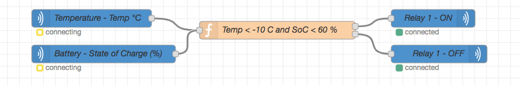
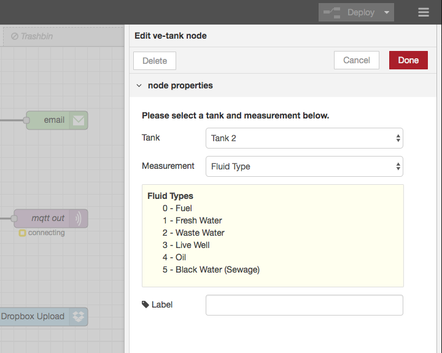

# Victron Energy Node Specification

The following listing will act as a specification for Victron Energy Node-RED nodes. The main purpose is to give the users a simple interface to create custom automations or 'flows' with Victron Energy's peripherals - without any existing knowledge on the underlying MQTT interface.

An example use case is shown below. A custom flow triggers a heater relay on, when both the ambient temperature drops below -10 °C and battery's state of charge dips below 60 %.



### Example on Node Definition

All the custom nodes will have an edit dialog showing available node-specific options for the user.  Here's an example of an edit dialog for a tank node and how it relates to the plain text initial description in this document.


```
Tank                [ Select: 1 .. N available tanks ]
Measurement         [ Select:
                        - Capacity (m3)
                        - Remaining (m3)
                        - Level (%)
                        - Fluid Type        -> Show Enum infotext
                        - Status            -> Show Enum infotext
                    ]
(Enum infotext)
Label               [ Text ]
```

... which will be implemented as follows:



All node options will be greyed out and a warning text shown if there are no relevant topics/services available.

All the nodes listed below will have a custom edit dialog as well as additional supporting logic, if required.

## Input Nodes

### Digital Input (input)
Lists all the available digital inputs and their respective dbus paths in the 'measurement' field.

Show corresponding descriptions for enums in an info box below the fields.

**Selectable options:**
```
Info                "The digital inputs can be configured in the UI:
                    Menu > Settings > I/O > Digital Inputs.

                    Access the remote console here (link to UI here)."

Digital Input       [ Select: 1 .. N available inputs:]
Measurement         [ Select:
                        For pulsemeters: (com.victronenergy.pulsemeter.inputXX)
                            - Aggregate (m3) - /Aggregate
                            - Pulse Count - /Count
                            - Connection Status (0/1) - /Connected
                        For digital inputs: (com.victronenergy.digitalinput.inputXX)
                            - Pin State (0/1) - /InputState
                            - State Description - /State -> Show Enum infotext
                            - Active Pulse Count - /Count
                            - Input Function* - /Type (seems to mirror ProductName) -> Show Enum infotext
                            - Connection Status (0/1) - /Connected
                    ]

(Enum infotext)

Label               [ Text ]
```


### Tank (input)
Lists all available tank level inputs.

**Selectable options:**
```
Info                "The tank sensors can be configured in the UI.
                    You can enable the sensors in Menu > Settings > I/O > Analog Inputs
                    and configure in Menu > [tank] > Setup.

                    Access the remote console here (link to UI here)."

Tank                [ Select: 1 .. N available tanks (com.victronenergy.tank.XX)]
Measurement         [ Select:
                        - Capacity (m3) - /Capacity
                        - Remaining (m3) - /Remaining
                        - Level (%) - /Level
                        - Fluid Type* - /FluidType -> Show Enum infotext
                        - Status - /Status -> Show Enum infotext
                        - Connection Status (0/1) - /Connected
                        - Standard* - /Standard -> Show Enum infotext
                    ]

(Enum infotext)

Label               [ Text ]
```


### Temperature (input)
External temperature inputs (e.g. Venus-GX temperature input).

**Selectable options:**
```
Info                "The temperature sensors can be configured in the UI.
                    You can enable the sensors in Menu > Settings > I/O > Analog Inputs
                    and configure in Menu > [sensor] > Setup.

Sensor              [ Select: 1 .. N available sensors (com.victronenergy.temperature.XX)]

Measurement         [ Select:
                        - Temperature (°C) - /Temperature
                        - Scale* - /Scale
                        - Offset* - /Offset
                        - Temperature Type* - /TemperatureType -> Show Enum infotext
                        - Status -> /Status -> Show Enum infotext
                    ]

(Enum infotext)

Label               [ Text ]
```


### Custom Topic (input)
(An advanced) user can subscribe to listen a custom dbus path.

Link to https://github.com/victronenergy/venus/wiki/dbus documentation

**Selectable options:**
```
D-Bus service    [ Text ] -> autofill from the cache
D-Bus path       [ Text ] -> autofill from the cache

Label            [ Text ]
```


### Inverter (input)

Lists the available measurements for an inverter.

The inverters can be found behind several dbus services:
    - com.victronenergy.inverter.* (for VE.Direct inverters)
    - com.victronenergy.vebus.* (for VE.Bus inverters)

For VE.Bus services, we need to ensure, that the vebus service has an inverter product id.

```

Inverter            [ Select: 1 .. N available inverters ]

Measurement         [ Select:
                        For VE.Direct and VE.Bus inverters: (com.victronenergy.inverter.*)
                            - Battery Voltage (V) - /Dc/0/Voltage
                            - Output Voltage (V, AC) - /Ac/Out/L1/V
                            - Output Current (A, AC) - /Ac/Out/L1/I
                            - Mode - /Mode -> Show Enum infotext
                            - State - /State -> Show Enum infotext
                    ]

(Enum infotext)

Label           [ Text ]
```


### PV Inverter (input)

Lists the available measurements for a pv inverter (com.victronenergy.pvinverter.*).

```

PV Inverter         [ Select: 1 .. N available PV inverters ]

Measurement         [ Select: (com.victronenergy.pvinverter.*)
                        - L1 Voltage (V, AC) - /Ac/L1/Voltage
                        - L1 Current (A, AC) - /Ac/L1/Current
                        - L1 Energy (kWh) - /Ac/L1/Energy/Forward
                        - L1 Power (W) - /Ac/L1/Power
                        - L2 Voltage(V, AC) - /Ac/L2/Voltage
                        - L2 Current (A, AC) - /Ac/L2/Current
                        - L2 Energy (kWh) - /Ac/L2/Energy/Forward
                        - L2 Power (W) - /Ac/L2/Power
                        - L3 Voltage(V, AC) - /Ac/L3/Voltage
                        - L3 Current (A, AC) - /Ac/L3/Current
                        - L3 Energy (kWh) - /Ac/L3/Energy/Forward
                        - L3 Power (W) - /Ac/L3/Power
                        - Total Energy (kWh) - /Ac/Energy/Forward
                        - Total Power (W) - /Ac/Power
                        - Energy (DC)
                        - Mode - /Position -> Show Enum infotext
                        - Status - /StatusCode -> Show Enum infotext
                    ]

(Enum infotext)

Label           [ Text ]
```


### AC Charger (input)

Lists the available measurements for an AC charger (com.victronenergy.charger.*).

AC Charger          [ Select: 1 .. N available AC chargers ]

```
Device              [ Select: (com.victronenergy.charger.*)
                        - Input Current (A) - /Ac/In/L1/I
                        - Input Power (W) - /Ac/In/L1/P
                        - Input Current Limit (A) - /Ac/In/CurrentLimit
                        - Battery 1 Voltage (V) - /Dc/0/Voltage
                        - Battery 1 Current (A) - /Dc/0/Current
                        - Battery 1 Temperature (°C) - /Dc/0/Temperature
                        - Battery 2 Voltage (V) - /Dc/1/Voltage
                        - Battery 2 Current (A) - /Dc/1/Current
                        - Battery 2 Temperature (°C) - /Dc/1/Temperature
                        - State - /State -> Show Enum infotext
                        - Mode - /Mode -> Show Enum infotext
                        - Relay State* (on/off)- /Relay/0/State
                    ]

(Enum infotext)

Label           [ Text ]
```


### Solar Charger (input)

Lists the available measurements for a solar charger (com.victronenergy.solarcharger.*)


```
Solar Charger       [ Select: 1 .. N solar chargers com.victronenergy.solarcharger.*) ]

Device              [ Select:
                        - Battery Voltage (V, DC) - /Dc/0/Voltage
                        - Charging Current (A, DC) - /Dc/0/Current
                        - PV Array Voltage (V, DC) - /Pv/V
                        - PV Array Current (A, DC) - /Pv/I
                        - Solar Power (W) - /Yield/Power
                        - Yield Since Reset - /Yield/User
                        - Yield Since Update - /Yield/System
                        - Load State (on/off) - /Load/State
                        - Load Current (A, DC) - /Load/I
                        - Error Code - /ErrorCode -> Show Enum infotext
                        - Mode - /Mode -> Show Enum infotext
                        - State - /State -> Show Enum infotext
                    ]

(Enum infotext)

Label           [ Text ]
```


### Battery (input)
```
Battery             ( ) Battery 1
                    ( ) Battery 2
                    ( ) Battery 3
                    ( ) Battery N ...

Measurement         [ Select:
                        - Voltage (V)
                        - Current (A)
                        - Temperature (°C)
                        - Consumed Charge (Ah)
                        - State of Charge (%)
                        - State of Health (%)
                        - Time to Go (s)
                        - Battery Low Threshold (V)
                        - Capacity (Ah)
                        - Relay State (on/off)
                        - External Relay State (on/off)
                    ]

(Enum infotext)

Label               [ Text ]
```


### Grid Meter (input)

Show available grid meter measurements (com.victronenergy.grid.*).

```
Device              [ Select:
                        - Power (W) - /Ac/Power
                        - Forward Energy (kWh) - /Ac/Energy/Forward
                        - Reverse Energy (kWh) - /Ac/Energy/Reverse
                        - Error Code - /ErrorCode -> Show Enum infotext

                        - L1 Current (A, AC) - /Ac/L1/Current
                        - L1 Voltage (V, AC) - /Ac/L1/Voltage
                        - L1 Power (W) - /Ac/L1/Power
                        - L1 Forward Energy (kWh) - /Ac/L1/Energy/Forward
                        - L1 Reverse Energy (kWh) - /Ac/L1/Energy/Reverse

                        - L2 Current (A, AC) - /Ac/L2/Current
                        - L2 Voltage (V, AC) - /Ac/L2/Voltage
                        - L2 Power (W) - /Ac/L2/Power
                        - L2 Forward Energy (kWh) - /Ac/L2/Energy/Forward
                        - L2 Reverse Energy (kWh) - /Ac/L2/Energy/Reverse

                        - L3 Current (A, AC) - /Ac/L3/Current
                        - L3 Voltage (V, AC) - /Ac/L3/Voltage
                        - L3 Power (W) - /Ac/L3/Power
                        - L3 Forward Energy (kWh) - /Ac/L3/Energy/Forward
                        - L3 Reverse Energy (kWh) - /Ac/L3/Energy/Reverse
                    ]

Label               [ Text ]
```


### Generator (input)

Show the generator measurements (com.victronenergy.genset.*)

```
Device              [ Select:
                        - Generator Status - /StatusCode -> Show Enum infotext
                        - Generator Error Status - /ErrorCode (166 error codes - maybe not relevant)
                        - Autostart Status - /AutoStart -> Show Enum infotext
                        - Engine Load (%) - /Engine/Load
                        - Engine Speed (RPM) - /Engine/Speed
                        - Engine Operating Hours (h) - /Engine/OperatingHours
                        - Engine Coolant Temperature (°C) - /Engine/CoolantTemperature
                        - Engine Winding Temperature (°C) - /Engine/WindingTemperature
                        - Engine Exhaust Temperature (°C) - /Engine/ExaustTemperature
                        - Starter Battery Voltage (V, DC) - /StarterVoltage

                        - L1 Current (A, AC) - /Ac/L1/Current
                        - L1 Voltage (V, AC) - /Ac/L1/Voltage
                        - L1 Power (W) - /Ac/L1/Power
                        - L1 Frequency (Hz) - /Ac/L1/Frequency

                        - L2 Current (A, AC) - /Ac/L2/Current
                        - L2 Voltage (V, AC) - /Ac/L2/Voltage
                        - L2 Power (W) - /Ac/L2/Power
                        - L2 Frequency (Hz) - /Ac/L2/Frequency

                        - L3 Current (A, AC) - /Ac/L3/Current
                        - L3 Voltage (V, AC) - /Ac/L3/Voltage
                        - L3 Power (W) - /Ac/L3/Power
                        - L3 Frequency (Hz) - /Ac/L3/Frequency
                    ]

(Enum infotext)

Label               [ Text ]
```

### VE.Bus Systems (input)
Lists available VE.Bus systems (Multis, Quattros, Inverters) under com.victronenergy.vebus.* services.
This same node should be displayed as 'MultiPlus' and 'Quattro' nodes if it's somehow feasible in Node-RED (e.g. subflows).


**Selectable options:**
```
Device       [ Select: 1 .. N devices ]

Measurement         [ Select:
                        - Battery Voltage (V, DC) - /Dc/0/Voltage
                        - Charging Current (A, DC) - /Dc/0/Current
                        - Battery SoC (%) - /Soc
                        - Extra Battery Current (A, DC)* - /ExtraBatteryCurrent

                        - Input Voltage (V, AC) - /Ac/ActiveIn/L1/V
                        - Input Current (A, AC) - /Ac/ActiveIn/L1/I
                        - Input Frequency (Hz) - /Ac/ActiveIn/L1/F
                        - Input Power (W) - /Ac/ActiveIn/L1/P

                        - Output Voltage (V, AC) - Ac/Out/L1/V
                        - Output Current (A, AC) - /Ac/Out/L1/I
                        - Output Frequency (Hz) - /Ac/Out/L1/F
                        - Output Power (W) - /Ac/Out/L1/P

                        - Active Input (N) - /Ac/ActiveIn/ActiveInput
                        - Current Limit - /Ac/ActiveIn/CurrentLimit
                        - Connection Status - /Ac/ActiveIn/Connected -> Show Enum infotext
                        - Mode - /Mode -> Show Enum infotext
                        - State - /State -> Show Enum infotext
                        - (label)* - /Energy/InverterToAcOut
                    ]

Label               [ Text ]
```


### Relay (output)
Lists all available relays.

**Selectable options:**
```
Relay       [ Select: 1 .. N relays ]

State               (*) on
                    ( ) off
                    ( ) toggle

Label               [ Text ]
```


## Output Nodes


### Inverter (output)

```

Inverter       [ Select: 1 .. N inverters ]

Mode                (*) on
                    ( ) economy
                    ( ) off

Label               [ Text ]
```


### PV Inverter (output)

(No writable paths in dbus)


### AC Charger (output)
```
Mode                (*) on
                    ( ) off

Label               [ Text ]
```


### Generator (output)
```
Mod                 (*) stopped
                    ( ) started

Label               [ Text ]
```


### Custom Topic (output)
(up for discussion)


## Configuration Nodes


### Global Configuration Node (config)
The global configuration node will handle all the common tasks:

* Establish the DBUS connection via socket
* Maintain a dbus service cache
* Serve as a REST endpoint with available services for nodes

It is never visible to the user.
